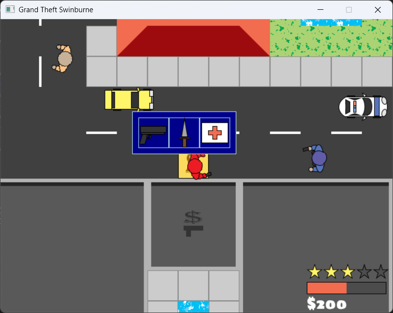

# Grand Theft Auto 2D

A small 2D Grand Theft Auto inspired game.



In this game you can explore the city, drive cars, get money and shoot people. Your wanted level will increase based on the severity of the crimes you commit which will make the cops more aggressive and harder to outrun. Killing people gives you money in this game, which you can spend at the shops on cars, guns and healing items.

## Controls
- Move: <kbd>W</kbd>,<kbd>A</kbd>,<kbd>S</kbd>,<kbd>D</kbd>
- Shoot: <kbd>Left Mouse</kbd>
- Drive: <kbd>E</kbd>
- Shop: <kbd>Q</kbd>
- Pause: <kbd>Esc</kbd>

## Build and Run
This game requires that you have the Splashkit SDK installed on your system to be able to build. A guide for this can be found [here](https://splashkit.io/installation/).

Clone the repository:
```sh
git clone "https://github.com/Alex-Petrucci/GrandTheftAuto2D.git"
```

Then to build and run, use:
```sh
dotnet run
```